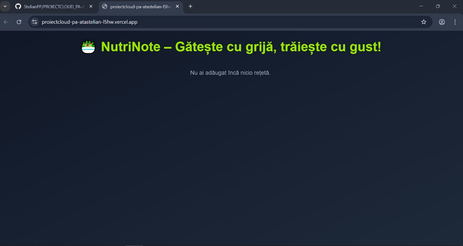
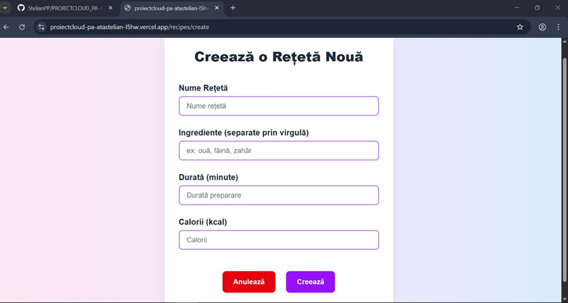
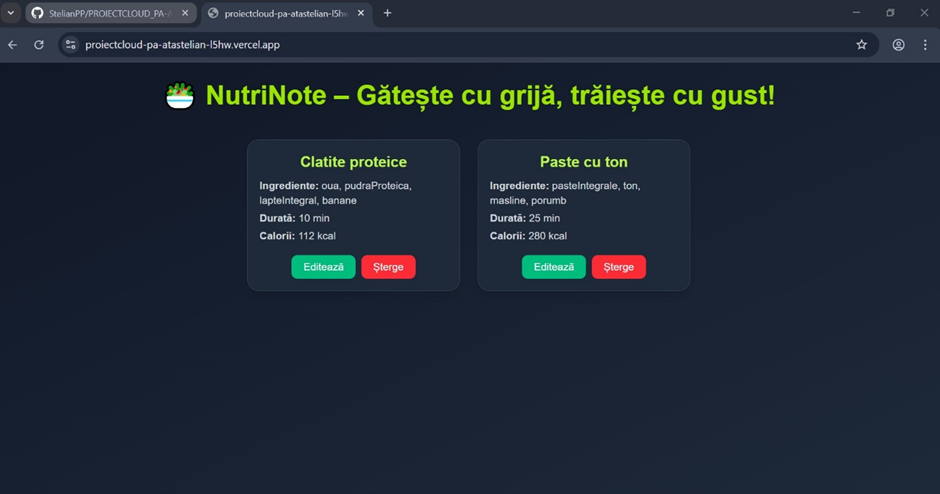
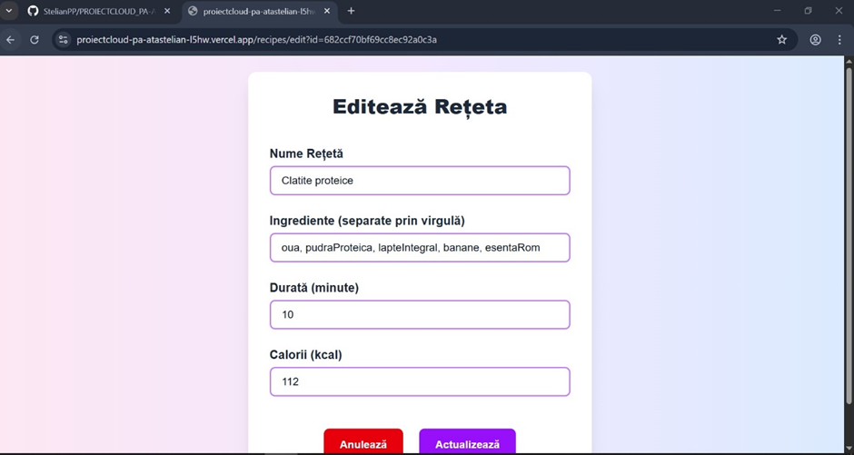
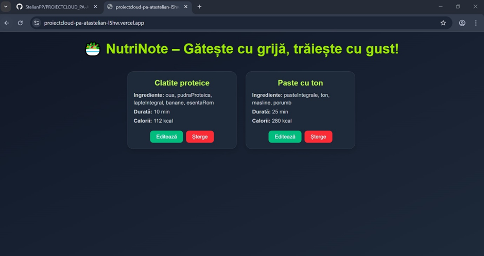
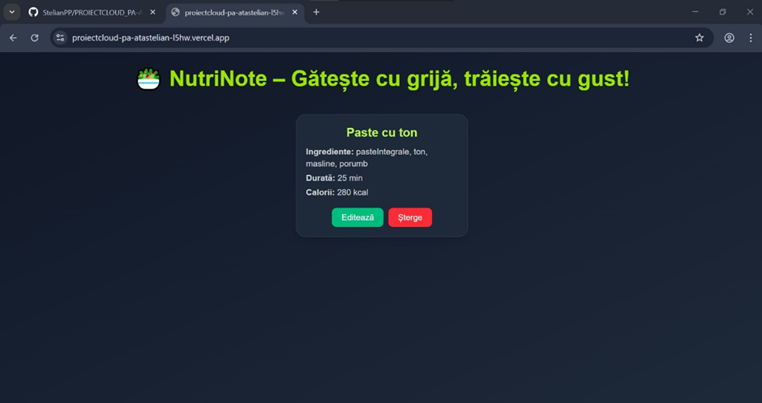

This is a [Next.js](https://nextjs.org) project bootstrapped with [`create-next-app`](https://nextjs.org/docs/pages/api-reference/create-next-app).

DOCUMENTATIE PROIECT CLOUD COMPUTING PASATA STELIAN, GRUPA 1134 SIMPRE

ACADEMIA DE STUDII ECONOMICE DIN BUCUREȘTI
MASTER- SISTEME INFORMATICE PENTRU MANAGEMENTUL RESURSELOR ȘI PROCESELOR ECONOMICE


PROIECT CLOUD COMPUTING
-NUTRINOTE-


Cadrul didactic coordonator- Lungu Mihai-Adrian
Student-Pașata Stelian
Grupa 1134
LINK YOUTUBE 
LINK VERCEL  https://proiectcloud-pa-atastelian-l5hw.vercel.app/
LINK GITHUB  https://github.com/StelianPP/PROIECTCLOUD_PA-ATASTELIAN
Introducere
Aplicația NutriNote reprezintă un instrument modern și eficient pentru monitorizarea alimentației zilnice, facilitând gestionarea caloriilor și a compoziției meselor într-un mod intuitiv și accesibil. Prin intermediul acestei platforme, utilizatorii pot înregistra rapid și precis alimentele consumate, urmărind astfel aportul caloric și progresul către un stil de viață echilibrat și sănătos.
NutriNote oferă funcționalități complete de tip CRUD (Create, Read, Update, Delete), permițând adăugarea, vizualizarea, modificarea și ștergerea înregistrărilor alimentare cu ușurință. Astfel, utilizatorii beneficiază de o experiență simplă și eficientă, care sprijină adoptarea unor obiceiuri alimentare responsabile și conștiente.
Datele colectate sunt stocate în siguranță într-o bază de date MongoDB, asigurând integritatea și accesibilitatea acestora în orice moment. În plus, platforma este găzduită pe Vercel, garantând performanță ridicată și disponibilitate continuă, indiferent de locația utilizatorului.
Prin NutriNote, fiecare utilizator poate transforma monitorizarea alimentației într-un proces organizat și bine structurat, contribuind astfel la îmbunătățirea calității vieții și la menținerea sănătății pe termen lung.
Descrierea problemei 
În contextul actual al unui stil de viață din ce în ce mai agitat și solicitant, gestionarea alimentației zilnice devine o provocare majoră pentru mulți indivizi. Menținerea unui echilibru nutrițional adecvat necesită monitorizarea atentă a caloriilor și a compoziției meselor, ceea ce poate fi dificil și consumator de timp fără un instrument adecvat.
Aplicația NutriNote răspunde acestei nevoi, oferind o soluție practică și accesibilă pentru urmărirea alimentației și gestionarea aportului caloric zilnic. Indiferent dacă utilizatorii urmăresc să-și controleze greutatea, să adopte un stil de viață sănătos sau să-și optimizeze nutriția, NutriNote le permite să își organizeze informațiile alimentare într-un mod clar și eficient.
Provocarea pe care o abordează NutriNote constă în simplificarea procesului de monitorizare a consumului alimentar, oferind un instrument digital ușor de utilizat care sprijină luarea deciziilor conștiente legate de alimentație. Astfel, utilizatorii pot gestiona cu ușurință datele despre mesele lor, facilitând atingerea obiectivelor nutriționale într-un mod structurat și motivant.
Tehnologiile CLOUD utilizate
În dezvoltarea aplicației NutriNote, am integrat tehnologii moderne din sistemul cloud pentru a asigura funcționarea eficientă, disponibilitatea permanentă și o experiență fluidă pentru utilizator.
Pentru partea de stocare a datelor, am folosit MongoDB, o soluție de tip NoSQL, potrivită pentru aplicații care necesită o structură flexibilă a datelor. Această tehnologie ne-a permis să salvăm cu ușurință informații precum denumirea rețetei, ingredientele, timpul de preparare și conținutul caloric. MongoDB se remarcă prin performanță ridicată în manipularea unor volume mari de date și prin capacitatea sa de scalare, ceea ce o face potrivită pentru extinderea viitoare a aplicației.
Pentru publicarea și rularea aplicației pe internet, am optat pentru Vercel, o platformă cloud orientată spre dezvoltatorii care lucrează cu framework-uri moderne precum Next.js. Vercel ne-a oferit posibilitatea de a implementa rapid aplicația, fără a fi necesară administrarea clasică a serverelor. Prin automatizarea procesului de build și deploy, aplicația este disponibilă online într-un mod rapid și sigur.
Prin utilizarea MongoDB pentru gestionarea datelor nutriționale și Vercel pentru livrarea aplicației web, am creat o platformă robustă, adaptabilă și ușor de întreținut. Aceste instrumente ne-au permis să ne concentrăm pe funcționalitatea aplicației și pe oferirea unei experiențe intuitive utilizatorilor care își doresc să monitorizeze mai atent alimentația zilnică.

Descriere API – NutriNote
În cadrul aplicației NutriNote, comunicarea cu baza de date este realizată printr-un API dedicat, care asigură funcționalitățile esențiale de tip CRUD (Create, Read, Update, Delete) asupra entităților de tip rețetă. API-ul a fost construit folosind metodele standard ale protocolului HTTP, facilitând interacțiunea dintre interfața aplicației și datele persistente.
Rutele și funcționalitățile API-ului pentru rețete:
GET/api/recipes
      Această rută returnează lista tuturor rețetelor stocate în baza de date. Dacă nu există rețete, se returnează un array gol. În caz contrar, răspunsul conține un array cu obiecte reprezentând rețetele disponibile.
GET/api/recipes?id=:id
       Permite obținerea unei rețete individuale, identificată prin ID-ul transmis ca parametru de interogare. Dacă rețeta este găsită, datele ei sunt returnate în format JSON; în caz contrar, răspunsul este nul.
POST/api/recipes
        Creează o nouă rețetă pe baza datelor transmise în corpul cererii (body), în format JSON. Aceste date includ informații precum denumirea, ingredientele, timpul de preparare sau valoarea calorică. Răspunsul va conține rețeta nou creată.
PUT/api/recipes
          Actualizează o rețetă existentă, identificată prin ID-ul inclus în datele transmise. Se modifică doar câmpurile furnizate în cerere. Răspunsul reflectă modificările realizate.
DELETE/api/recipes?id=:id
          Șterge rețeta corespunzătoare ID-ului transmis prin query string. Dacă ștergerea este realizată cu succes, răspunsul va include un mesaj de confirmare.
Acest API asigură o interfață robustă și clar definită pentru gestionarea datelor aplicației, susținând funcționalitatea NutriNote și oferind utilizatorilor o experiență intuitivă în organizarea alimentației zilnice.
Structura datelor pentru rețete (recipes)
În cadrul aplicației NutriNote, fiecare rețetă este reprezentată în baza de date printr-un obiect ce conține următoarele câmpuri esențiale:
•	Nume rețetă – Reprezintă denumirea rețetei introduse de utilizator, utilizată pentru identificare și afișare.
•	Ingrediente – O listă de ingrediente necesare preparării rețetei. Acest câmp este stocat sub forma unui array de stringuri pentru a permite o structurare clară și flexibilă.
•	Durata – Timpul estimativ de preparare al rețetei, exprimat în minute. Acest parametru oferă utilizatorilor posibilitatea de a-și planifica eficient mesele.
•	Calorii – Valoarea calorică totală a rețetei, exprimată în kilocalorii. Această informație este importantă pentru utilizatorii care doresc să își monitorizeze aportul caloric zilnic.
Fluxurile de date(response și request)
1.	GET /api/recipes
 Request - GET /api/recipes
 Response - {
    "data": [
        {
            "_id": "682cabed52e78f6f87bf0643",
            "title": "",
            "description": "",
            "name": "Clatite proteice",
            "ingredients": [
                "oua",
                "faina",
                "zahar"
            ],
            "duration": "45",
            "calories": "455"
        },

2.	POST /api/recipes
Request - POST /api/recipes
 Response -  {
    "data": {
        "_id": "682ccc77f8439e8bac581f78",
        "Nume Reteta": "Nume",
        "Ingrediente": "Ingrediente",
        "Durata": "Durata",
        "Calorii": "Calorii"
    }
}

3.	PUT /api/recipes
Request – PUT /api/recipes
Response - {
    "data": {
        "acknowledged": true,
        "modifiedCount": 0,
        "upsertedId": null,
        "upsertedCount": 0,
        "matchedCount": 0
    }
}
4.	DELETE /api/recipes
Request – DELETE /api/recipes
Response - {
    "data": {
        "acknowledged": true,
        "deletedCount": 1
    }
}

Metodele HTTP folosite:
1. Get: Obținerea unor înregistrări existente
2. Post: Crearea unor noi înregistrări
3. Put: Actualizarea înregistrărilor existente 
4. Delete: Ștergerea înregistrărilor existente

Screenshot-uri aplicația NutriNote







## Getting Started

First, run the development server:

```bash
npm run dev
# or
yarn dev
# or
pnpm dev
# or
bun dev
```

Open [http://localhost:3000](http://localhost:3000) with your browser to see the result.

You can start editing the page by modifying `pages/index.js`. The page auto-updates as you edit the file.

[API routes](https://nextjs.org/docs/pages/building-your-application/routing/api-routes) can be accessed on [http://localhost:3000/api/hello](http://localhost:3000/api/hello). This endpoint can be edited in `pages/api/hello.js`.

The `pages/api` directory is mapped to `/api/*`. Files in this directory are treated as [API routes](https://nextjs.org/docs/pages/building-your-application/routing/api-routes) instead of React pages.

This project uses [`next/font`](https://nextjs.org/docs/pages/building-your-application/optimizing/fonts) to automatically optimize and load [Geist](https://vercel.com/font), a new font family for Vercel.

## Learn More

To learn more about Next.js, take a look at the following resources:

- [Next.js Documentation](https://nextjs.org/docs) - learn about Next.js features and API.
- [Learn Next.js](https://nextjs.org/learn-pages-router) - an interactive Next.js tutorial.

You can check out [the Next.js GitHub repository](https://github.com/vercel/next.js) - your feedback and contributions are welcome!

## Deploy on Vercel

The easiest way to deploy your Next.js app is to use the [Vercel Platform](https://vercel.com/new?utm_medium=default-template&filter=next.js&utm_source=create-next-app&utm_campaign=create-next-app-readme) from the creators of Next.js.

Check out our [Next.js deployment documentation](https://nextjs.org/docs/pages/building-your-application/deploying) for more details.
